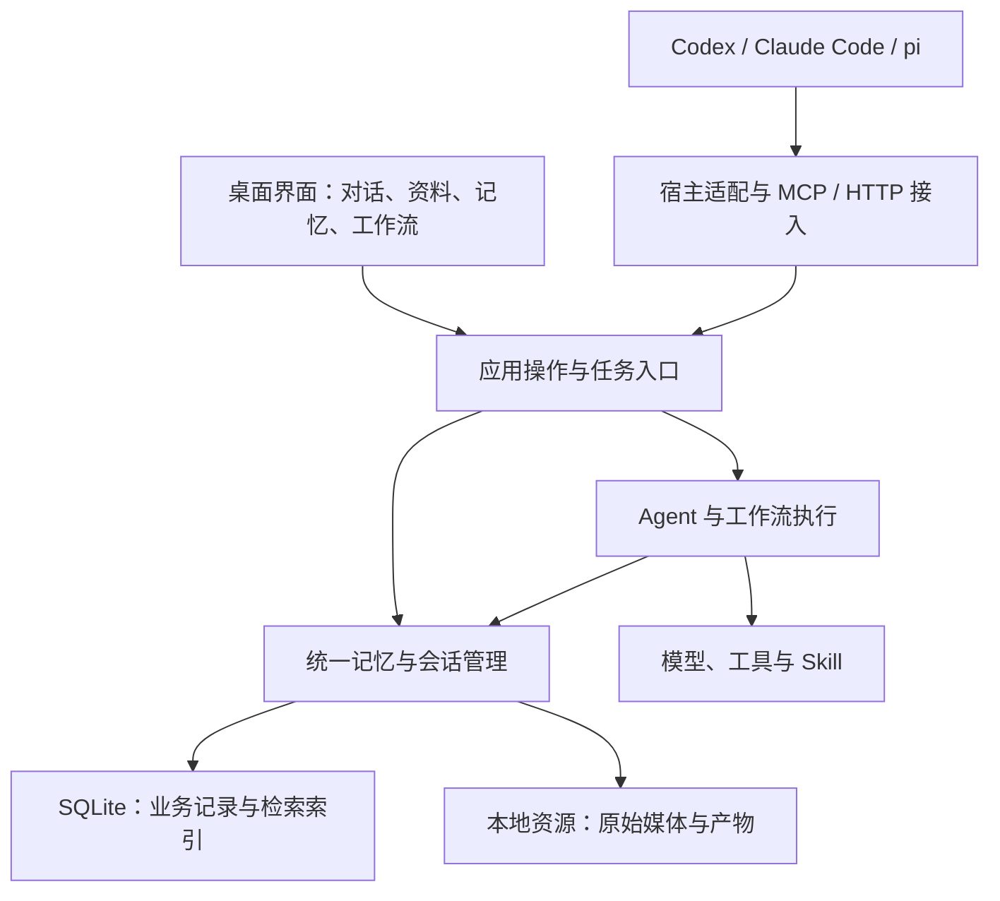

# 架构与边界

本文件整理职责和设计约束，供后续 Spec、Plan 使用。这里的模块表示逻辑职责，尚未确定为包、进程或独立服务。

## 整体关系



桌面界面和外部 Agent 使用同一套记忆能力。记忆与任务逻辑不依赖窗口组件存在，具体如何启动和管理进程由实施 Plan 决定。

## 职责划分

| 部分 | 负责什么 | 不应承担什么 |
| --- | --- | --- |
| 桌面界面 | 展示资料、对话、记忆来源、任务状态，编辑节点与连线。 | 直接绕过业务规则修改数据库或执行任意后台操作。 |
| 宿主适配 | 识别具体宿主会话，采集宿主提供的信息，处理接入时机和格式转换。 | 各自实现一套记忆提取、合并与纠错规则。 |
| 统一记忆与会话管理 | 管理材料、会话、记忆、证据及访问范围，提供检索、读取和变更操作。 | 把外部会话记录自动视为当前环境事实或执行指令。 |
| Agent 运行 | 组织模型和工具循环，装配当前任务上下文，记录执行状态和结果。 | 把具体领域的做事方法全部写进运行核心。 |
| Skill 与工具 | Skill 描述做事方法，工具执行具体操作并返回结果。 | 替代程序对访问范围、版本及实际执行结果的检查。 |
| 工作流执行 | 按约定执行节点、传递结果并维护流程状态。 | 仅根据画布连线推断尚未定义的执行语义。 |
| 存储与索引 | 保存业务数据和资源，维护迁移与索引一致性。 | 以向量相似度替代事实确认，或丢掉原始证据。 |

参考讨论中的 Memory Harness 指记忆子系统内部需要模型调查和整理时的执行组织。它与面向用户的独立 Agent 职责不同，可以复用通用模型与工具能力；是否使用同一运行实现，留到具体 Plan 确定。

## 数据应保留的层次

| 层次 | 内容 | 用途 |
| --- | --- | --- |
| 原始材料 | 对话、文档、图片、音频、视频及必要版本。 | 重新检查材料，保留结论形成时的依据。 |
| 可定位证据 | 消息位置、文档页码或区域、图片区域、音视频时间范围。 | 把某条记忆定位到支持它的具体内容。 |
| 提炼后的记忆 | 事实、偏好、决定、计划、状态和经验。 | 在后续任务中复用，并记录来源、时间和适用范围。 |

记忆条目可使用文本或结构化表示，具体数据模型未定。摘要、向量及索引属于派生内容，不能自动替代原始材料。

## 记忆的写入与读取

写入的目标流程是：

```text
提交交互或材料
→ 保存来源并解析内容
→ 提取候选记忆
→ 查找相关旧记忆、比较证据
→ 提议新增、合并、纠正或保留冲突
→ 程序校验并提交变更
```

模型提出变更建议，程序控制提交，检查访问范围、引用和版本等条件。引用存在只能证明材料可定位，不能证明模型理解正确。依据不足时需要保留不确定性。

读取的目标流程是：

```text
当前任务与问题
→ 在允许的范围内查找记忆、材料或会话
→ 返回相关内容与来源
→ 必要时回读证据
→ 调用方组织本次任务上下文
```

简单读取可以直接查询；跨材料矛盾、证据不足等情况，才需要进一步调查。具体同步、异步处理方式和提交时机由对应 Feature 定义。

删除或纠正材料时，要明确相关索引和派生记忆如何处理，防止后续检索继续把已撤销的信息当作有效结论。

## 多模态处理

- 文本提取、描述、转写和关键帧可以帮助检索，原始模态仍需保留。
- 图片内容与用户态度分别判断。同一张图用于表达偏好还是反例，应结合消息确定。
- 音视频证据应能定位回原始时间范围，必要时检查相邻上下文。
- 客户端无法读取某种模态时，可以使用摘要和提炼后的记忆，但结果应说明证据形式。

OCR、视觉理解、抽帧、转写、视频模型和向量的具体组合仍是候选，不在本文件确定算法与首版覆盖范围。

## 跨 Agent 会话关联

关联对象是宿主中的具体会话，而非一个笼统的 Agent 名称。设计需能区分项目、宿主、会话、工作区及必要的分支信息，并记录同步位置和时间。

当前目标是：

1. Agent 的具体会话关联到项目。
2. 其他 Agent 查询并发现相关会话。
3. 先读取摘要和进展，再按需读取记录、结论及产物依据。
4. 后续查询能够发现新增或纠正的信息。

会话同步记录表示“已采集到的状态”。外部 Agent 当前是否在线、是否完成某个操作，需要实际宿主提供的证据，不能只根据旧摘要推断。

主动投递消息、实时刷新上下文、等待回复和唤醒外部 Agent 是后续讨论项。MCP、HTTP、Hooks 和扩展的可用能力按实际宿主版本验证；不承诺所有客户端零配置、同等深度接入。

## 执行与持久化

当前任务状态由运行模块负责，跨会话记忆由记忆模块负责。外部 Agent 的运行状态仍以其宿主为准。

后续实现需要定义操作何时被接受、何时完成，以及失败或中断后哪些结果已经保存。模型生成、工具执行、数据提交和界面展示是不同步骤，不能把“模型说已完成”直接记录为任务完成。

工作流规定明确的步骤及依赖，Agent 在允许的步骤中自主选择行动。两者的控制权在 Plan 中写明，避免重复调度同一段工作。

## 下一步设计需要回答的问题

- 首个 Feature 具体跑通哪条用户流程，其验收证据是什么？
- 项目、会话、材料、证据、记忆和任务如何标识与关联？
- 桌面窗口、核心服务和后台任务如何运行，取消与退出如何处理？
- 记忆更新如何检测版本冲突，删除和索引更新如何保持一致？
- 工作流的节点输入输出、完成条件与恢复规则是什么？
- 外部客户端实际能采集什么、在何时读取新上下文？

这些问题进入对应 Feature 的 Spec 和 Plan。本轮文档不预建数据表、公共接口或工作流协议。
